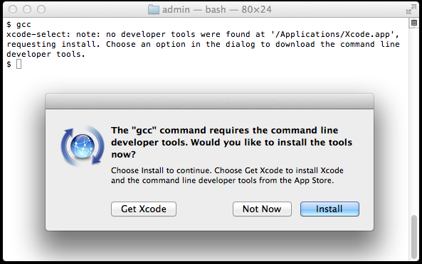
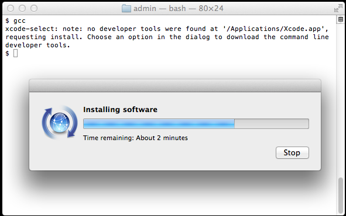

# La Collezione Dockerfile

Contained within this repo are Dockerfiles used for [Chef][] cookbook
development. As such they do not follow the normal Docker practice of
lightweight containers running a single process. Instead these are FatBoy™
containers complete with a process supervisor, SSH, [Serf][], [Consul][], CRON,
log rotation and NTP...

## Base images

The containers are built from several different base images. [Alpine Linux][]
provides a lightweight distribution based on musl libc and busybox. The Consul
server container, Nginx and [Seagull][] containers are based from the [Alpine Linux][] image.

CentOS 6.6 and 7.1, Fedora 21 and Ubuntu 14.04 base containers are configured to
behave like a standard node that is provisioned or bootstrapped with a Chef
client, in addition to having s6, Consul, CRON and syslog/rsyslogd.

	* Alpine Linux 1.3
	* CentOS 6.6
	* CentOS 7.1
	* Fedora 21
	* Ubuntu 14.04

## Base Containers

These containers form a base image layer that we build on to create the
following containers:

#### Consul Server

This image inherits from our base Alpine container and adds a Consul UI/Server,
DNS, and Service discovery. Consul has been configured to run with a single
server and this should only be used in development. In production it is
recommended you run a 3 to 5 member cluster.

Consul includes a DNS server to register service and host names. In order to use
the DNS Masq is run has been configured to forward all requests for dev to
Consul or all other requests to the original name servers (8.8.8.8, 8.8.4.4).

The consul Web gui runs on the default port of 8500.

	    * http://consul.mudbox.dev:8500

#### Docker

Based on the FatBax Ubuntu Trusty 14.02 this slaps on docker to the base
machines. This Docker container is what the Jenkins sales use so they can
provision containers locally.

#### Seagull

[Seagull][] provides a friendly Web UI to monitor docker and get a visual
representation of your running infrastructure.

		* http://seagull.mudbox.dev

## Quick Start Guide

Also know as 'runs with scissors' Assuming your machine meets the basic
requirements, has docker-machine installed running boot2docker version >= 1.6.2
and ChefDK;

 1) Clone the git repo and `bundle install` any required gems:

      $ git clone https://github.com/riddopic/docker-containers
      $ cd docker-containers
      $ bundle install

 2) Make all target containers:

      $ make all

Will build all the containers in this repo. To specify a particular target
replace all with the name of the target:

     $ make centos-6

## Requirements

Before trying to build and use the containers make sure you have a supported
system. You will need docker and docker-machine installed, with a boot2docker
ISO of 1.6.2 or higher, and Vagrant, and a virtualization platform such as
VirtualBox or VMware Fusion. To get running you will need:

 - Install Xcode Command line tools
 - Configure Git
 - Install Homebrew and Homebrew Cask
 - GNU Tools
 - Vagrant
 - VirtualBox
 - VMware Fusion
 - Docker Machine
 - ChefDK (Chef Developers Kit) and miscellaneous tools.

Thankfully this has become a relatively painless process so let’s get started!
We will be doing most of our work in a terminal windows, the quickest way to
open one is to use Spotlight, press Command-Spacebar key-combination and type in
"terminal" and slap that Enter key like you mean it!

### Is Xcode Already Installed?

You don’t need the full Xcode package to get the Xcode Command Line Tools.
However, you may have previously installed the full Xcode package. To check if
the full Xcode package is already installed:

	$ xcode-select -p

If you see:

	/Applications/Xcode.app/Contents/Developer

the full Xcode package is already installed.

You will need to update Xcode to the newest version (Xcode 6 or newer). Go to
the App Store application and check “Updates.” After updating Xcode, be sure to
launch the Xcode application and accept the Apple license terms.

If you see a file location that contains spaces in the path:

	/Applications/Apple Dev Tools/Xcode.app/Contents/Developer

you must delete Xcode. ChefDK and most command line tools will not work with
spaces in the path. You can either install only the Xcode Command Line Tools
(instructions below) or reinstalled the full Xcode package.

### Install Xcode Command Line Tools

Mac OS X Yosemite will alert you when you enter a command in the terminal that
requires Xcode Command Line Tools. For example, you can enter gcc, git, or make.

Try it. Enter:

	$ gcc

You’ll see an alert box:



Alternatively, you can use a command to install Xcode Command Line Tools. It
will produce a similar alert box. Note the double hyphen:

	$ xcode-select --install

Click “Install” to download and install Xcode Command Line Tools.

The instructions in the alert box are confusing. You don’t need to “Get Xcode”
from the App Store. Just click “Install” for the Xcode Command Line Tools.



Verify that you’ve successfully installed Xcode Command Line Tools:

	$ xcode-select -p
	/Library/Developer/CommandLineTools

Just to be certain, verify that gcc is installed:

	$ gcc --version
	Configured with: --prefix=/Library/Developer/CommandLineTools/usr --with-gxx-include-dir=/usr/include/c++/4.2.1
	Apple LLVM version 6.0 (clang-600.0.54) (based on LLVM 3.5svn)
	Target: x86_64-apple-darwin14.0.0
	Thread model: posix

### Configure Git

Git is automatically installed as part of the Xcode Command Line Tools. Or, if
you updated from a previous version of Mac OS X, you may have installed Git
previously.

Check that Git is installed:

	$ git version
	git version 1.9.3 (Apple Git-50)

Configure Git if you haven’t used it before. First, list the current settings
with the git config -l --global command. Then set user.name and user.email if
necessary:

	$ git config -l --global
	fatal: unable to read config file '/Users/.../.gitconfig': No such file or directory

	$ git config --global user.name "Your Real Name"
	$ git config --global user.email me@example.com
	$ git config --global color.ui true
	$ git config -l --global
	user.name=Your Real Name
	user.email=me@example.com

If you don’t have an SSH key generated yet to use with Git you can create one:

	$ ssh-keygen -t rsa -C "me@example.com"

The next step is to take the newly generated SSH key and add it to your Github
and/or Stash account. You want to copy and paste the output of the following
command and paste it here for Github, Stash will have a similar page to enter
your key but I will leave it up to you to find that link.

	$ cat ~/.ssh/id_rsa.pub

Once you've done this, you can check and see if it worked:

	$ ssh -T git@github.com

You should get a message like this:

	Hi riddopic! You've successfully authenticated, but GitHub does not provide shell access.

Now you’ll be ready to use Git when you need it.

### Install Homebrew

Homebrew is a package manager for OS X. If you ever meet the guy who wrote
Homebrew buy him a beer.

	$ ruby -e "$(curl -fsSL https://raw.githubusercontent.com/Homebrew/install/master/install)"

### Install Homebrew Cask

Next we need to install Homebrew Cask, an add-on that allows you to install OSX
applications from the command line:

	$ brew install caskroom/cask/brew-cask

### Install GNU Utilities

Now let’s have some fun and start installing some software! First make sure you
have the latest Homebrew:

	$ brew update

If you need to upgrade any already-installed formulae:

	$ brew upgrade

Next I like to install GNU core utilities (those that come with OS X are
outdated), if you do don’t forget to add
$(brew --prefix coreutils)/libexec/gnubin` to `$PATH`.

	$ brew install coreutils

Install some other useful utilities like `sponge`

	$ brew install moreutils

Install GNU `find`, `locate`, `updatedb`, and `xargs`, `g`-prefixed

	$ brew install findutils

Install GNU `sed`, overwriting the built-in `sed`

	$ brew install gnu-sed --default-names

Now, let’s do some quick housekeeping:

	$ brew cleanup

### Install Vagrant

GUI type applications are installed with Cask:

	$ brew cask install vagrant

### Install VirtualBox

	$ brew cask install virtualbox

#### Install VMware Fusion

You will need a license to use this.

	$ brew cask install vmware-fusion

### Install Docker Machine

	$ brew install docker docker-machine

#### Also install figlet:

  $ brew install figlet

#### Install ChefDK

	$ brew cask install chefdk

I prefer to use iTerm instead of the built-in Terminal application:

	$ brew cask install iterm2

Finally, you are going to need a good editor, vi, emacs, Atom, Textmate, are all
super editors, pick one if you don’t already have one you like:

GitHubs Atom editor:

	$ brew cask install atom

Sublime Text:

	$ brew cask install sublime-text

Textmate:

	$ brew cask install textmate

#### Starting a Docker Machine

We are going to launch our machine with 4GB of RAM and a 40GB volume using
version 1.6.2 of boot2docker:

##### VMware Workstation example:

    $ docker-machine create -d vmwarefusion \
      --vmwarefusion-memory-size 4096 \
      --virtualbox-disk-size 40000 \
      --vmwarefusion-boot2docker-url https://github.com/boot2docker/boot2docker/releases/download/v1.6.2/boot2docker.iso \
      dev -D

    INFO[0000] Downloading boot2docker.iso from https://github.com/boot2docker/boot2docker/releases/download/v1.6.2/boot2docker.iso...
    INFO[0014] Creating SSH key...
    INFO[0014] Creating VM...
    INFO[0014] Starting dev...
    INFO[0016] Waiting for VM to come online...
    INFO[0057] "dev" has been created and is now the active machine.
    INFO[0057] To point your Docker client at it, run this in your shell: docker-machine env dev | source

This will create a docker-machine named `dev` with the `vmwarefusion` complete
with 4GB of RAM and 40GB volume and have specified a URL for where to obtain the
boot2docker.ISO

##### VirtualBox example:

The default driver is Virtualbox and works virtually like the VMware driver
except where it doesn't.

	$ docker-machine create -d virtualbox \
	  --virtualbox-memory 4096 \
	  --virtualbox-disk-size 40960 \
	  --virtualbox-boot2docker-url https://github.com/boot2docker/boot2docker/releases/download/v1.6.2/boot2docker.iso \
	  dev

Once you docker-machine is up modify your shell environment to point to this
docker-machine instance;

To enable for just the current shell session, in sh, bash, and zsh:

     $ eval "$(docker-machine env dev)"

In fish:

     $ eval (chef shell-init fish)

To permanently enable (**recommended**):

In sh, bash, and zsh:

    $ echo 'eval "$(chef shell-init SHELL_NAME)"' >> ~/.YOUR_SHELL_RC_FILE

In fish:

    $ echo 'eval (chef shell-init SHELL_NAME)' >> ~/.config/fish/config.fish

Now check that your dockers are in order, first make sure your shell environment
settings are correctly setup by running:

	$ docker-machine ls
	NAME  ACTIVE  DRIVER        STATE    URL                       SWARM
	dev   *       vmwarefusion  Running  tcp://192.168.3.133:2376

Now let’s make sure you can connect to the machine via SSH:

	$ docker-machine ssh dev

	                        ##        .
	                  ## ## ##       ==
	               ## ## ## ##      ===
	           /""""""""""""""""\___/ ===
	      ~~~ {~~ ~~~~ ~~~ ~~~~ ~~ ~ /  ===- ~~~
	           \______ o          __/
	             \    \        __/
	              \____\______/
	 _                 _   ____     _            _
	| |__   ___   ___ | |_|___ \ __| | ___   ___| | _____ _ __
	| '_ \ / _ \ / _ \| __| __) / _` |/ _ \ / __| |/ / _ \ '__|
	| |_) | (_) | (_) | |_ / __/ (_| | (_) | (__|   <  __/ |
	|_.__/ \___/ \___/ \__|_____\__,_|\___/ \___|_|\_\___|_|
	Boot2Docker version 1.5.0, build vmw-1.5.0 : 67fcb7d - Wed Feb 18 10:00:58 UTC 2015
	Docker version 1.5.0, build a8a31ef
	docker@dev:~$

Finally, let’s try and launch a container:

	$ docker run -t -i centos:centos6 /bin/bash
	[root@fec71bd20e3c /]#

If all goes well you should find yourself in the shell of your newly created
CentOS container. Just type exit to go back to your normal shell and the machine
will then terminate. We can verify it has been shutdown with the docker command:

	$ docker ps -a
		CONTAINER ID        IMAGE               COMMAND                CREATED             STATUS                        PORTS               NAMES
		fec71bd20e3c        centos:centos6      "/bin/bash"            11 minutes ago      Exited (0) 11 minutes ago                         trusting_nobel

#### Configure Shell Environment for ChefDK Ruby

The ChefDK comes with it's own self-contained Ruby environment that plays well
with the rest of the Chef toolchain such as Berkshelf, Test Kitchen, ChefSpec
and Chef Provisioning. Activating the ChefDK Ruby environment in your shell is
done similarly to how it's done for docker-machine:

To enable for just the current shell session, in sh, bash, and zsh:

     $ eval "$(chef shell-init bash)"

In fish:

     $ eval (chef shell-init fish)

To permanently enable (**recommended**):

In sh, bash, and zsh:

    $ echo 'eval "$(chef shell-init SHELL_NAME)"' >> ~/.YOUR_SHELL_RC_FILE

In fish:

    $ echo 'eval (chef shell-init fish)' >> ~/.config/fish/config.fish

This will ensure SHELL PATH and ENVIRONMENT variables are configured correctly
for use with the ChefDK.

    $ which ruby
    /opt/chefdk/embedded/bin/ruby

Next we are going to bring up a virtual interface forAlias the loopback
interface. The reason for the loopback interface is to allow us to wildcard
*.dev record to go to a default address, for this we use the lo0 alias.

     $ sudo ifconfig lo0 alias 10.254.254.254

This then allows you to access your machine as with any *.dev domain.

     $ sudo route -n add 172.17.0.0/16 $(docker-machine ip)

In you `~/.ssh/config` ensure you have the following four lines:

Disable strict host key checking for SSH and connect as the kitchen user to our
docker instances:

	  Host *.dev
	    User kitchen
	    StrictHostKeyChecking no
	    UserKnownHostsFile /dev/null

Create the /etc/resolver directory and create the dev zone file:

	$ mkdir /etc/resolver
	$ echo "nameserver ${CONSUL_IP}" >> /etc/resolver/dev

What will now happen is any DNS lookups for the .dev top level domain will be
sent to the address listed in the /etc/resolver/dev file. The .dev domain had
for years been a private network which ICANN keep safe from the corporate
raiders. However recent changes in leadership at ICANN, bribes, corporate
raiding, user backlash and some the occasion blogger postings have lead to
the .dev domain fate being that of an unknown elephant waiting at the bus stop
for exact change.

### Chef 12 Server

Based off the Ubuntu 'FatBoy' 14.04 image, this image runs a Chef 12 Server, and
is specifically not configured with any redundancy nor is any of the data backed
up. This is purposefully done to ensure that it is regularly recycled and that
anything used to build the infrastructure is captured and automated.

#### Environment Variables

 - `PUBLIC_URL` - should be configured to a full public URL of the
   endpoint (e.g. `https://chef.mudbox.dev`)
 - `OC_ID_ADMINISTRATORS` - if set, it should be a comma-separated list of
   users that will be allowed to add oc_id applications (the Supermarket
   for example).

#### Ports

 - Ports 80 (HTTP) and  443 (HTTPS) are exposed.

#### Usage

To start the container `chef` with the hostname set to `chef.mudbox.dev`, using
the riddopic/chef-server base container:

	$ docker run -d --name chef -h chef.mudbox.dev \
		-e 'PUBLIC_URL=https://chef.mudbox.dev OC_ID_ADMINISTRATORS=jenkins' \
			riddopic/chef-server

#### Prerequisites and first start

The `kernel.shmmax` and `kernel.shmall` sysctl values should be set to
a high value on the docker-machine host.

To set the `kernel.shmmax` and `kernel.shmall` sysctl values run the following
on your docker hosts:

	$ docker-machine ssh dev -- sudo sysctl -w kernel.shmmax=17179869184
	$ docker-machine ssh dev -- sudo sysctl -w kernel.shmall=4194304

To make the change permanent add the values to `/etc/sysctl.con`:

	$ docker-machine ssh dev -- sudo sh -c 'kernel.shmmax=17179869184" \
		>> sysctl.conf'
	$ docker-machine ssh dev -- sudo sh \
		-c 'kernel.shmall=4194304" >> sysctl.conf'

First start will automatically run `chef-server-ctl reconfigure`. Subsequent
starts will not run `reconfigure`, unless file `/var/opt/opscode/bootstrapped`
has been deleted. You can run `reconfigure` (e.g. after editing
`etc/chef-server.rb`) using `docker-enter`.

#### Maintenance commands

Use `docker exec` to run commands on your Chef server:

    $ docker exec $CONTAINER_ID chef-server-ctl status
    $ docker exec $CONTAINER_ID chef-server-ctl user-create …
    $ docker exec $CONTAINER_ID chef-server-ctl org-create …
    $ docker exec $CONTAINER_ID chef-server-ctl …

#### Building

    $ cd docker-containers/chef-server && make build

      Building chef-server container from Dockerfile:
        Repository:   [acme]
	      Name:       [chef-server]
	      Version:    [12.3]

      docker build -t riddopic/chef-server:12.3 .
    	Sending build context to Docker daemon 32.26 kB
    	Sending build context to Docker daemon
    	Step 0 : FROM riddopic/ubuntu-14.04
    	 ---> fdf1de186398
    	Step 1 : MAINTAINER Stefano Harding <riddopic@gmail.com>
    	 ---> Using cache
    	 ---> 57c555b6c956
    	Step 2 : EXPOSE 80 443
    	 ---> Running in a37640aa6058
    	 ---> d7de20a31256
    	Removing intermediate container a37640aa6058
    	Step 3 : ENV ENV GOMAXPROCS=2 DEBIAN_FRONTEND=noninteractive KNIFE_HOME=/etc/chef
    	 ---> Running in b1052cb051e5
    	 ---> c93827c0de6c
    	Removing intermediate container b1052cb051e5
    	Step 4 : RUN apt-get-min update;
    	             apt-get-install-min logrotate hardlink chef-server-core;
    	             rm -rf /etc/opscode;
    	             ln -sfv /var/opt/opscode/log /var/log/opscode;
    	             ln -sfv /var/opt/opscode/etc /etc/opscode;
    	             ln -sfv /opt/opscode/sv/logrotate /opt/opscode/service;
    	             ln -sfv /opt/opscode/embedded/bin/sv /opt/opscode/init/logrotate;
    	             chef-apply -e 'chef_gem "knife-opc"';
    	             apt-get-min clean;
    	             rm -rf /tmp/* /var/tmp/* /var/lib/apt/lists/* /var/cache/apt/archives/*
    	 ---> Running in c6b15e1e0192
    	Get:1 http://mirrors.dev trusty InRelease [1730 B]
    	Get:2 http://mirrors.dev trusty-updates InRelease [1762 B]
    	Get:3 http://mirrors.dev trusty-security InRelease [1766 B]
    	Get:4 http://mirrors.dev chef InRelease [1722 B]
    	Get:5 http://mirrors.dev trusty/main amd64 Packages [9620 kB]
    	Get:6 http://mirrors.dev trusty-updates/main amd64 Packages [1062 kB]
    	Get:7 http://mirrors.dev trusty-security/main amd64 Packages [490 kB]
    	Get:8 http://mirrors.dev chef/main amd64 Packages [1586 B]
    	Fetched 11.2 MB in 1s (5943 kB/s)
    	Reading package lists...
    	Reading package lists...
    	Building dependency tree...
    	Reading state information...
    	logrotate is already the newest version.
    	The following NEW packages will be installed:
    	  chef-server-core hardlink
    	0 upgraded, 2 newly installed, 0 to remove and 0 not upgraded.
    	Need to get 460 MB of archives.
    	After this operation, 1211 MB of additional disk space will be used.
    	Get:1 http://mirrors.dev/ubuntu/public/ trusty/main hardlink amd64 0.2.0 [12.4 kB]
    	Get:2 http://mirrors.dev/ubuntu/public/ chef/main chef-server-core amd64 12.0.8-1 [460 MB]
    	Fetched 460 MB in 9s (46.4 MB/s)
    	Selecting previously unselected package hardlink.
    	(Reading database ... 29926 files and directories currently installed.)
    	Preparing to unpack .../hardlink_0.2.0_amd64.deb ...
    	Unpacking hardlink (0.2.0) ...
    	Selecting previously unselected package chef-server-core.
    	Preparing to unpack .../chef-server-core_12.0.8-1_amd64.deb ...
    	Unpacking chef-server-core (12.0.8-1) ...
    	Setting up hardlink (0.2.0) ...
    	Setting up chef-server-core (12.0.8-1) ...
    	Thank you for installing Chef Server!
    	'/var/log/opscode' -> '/var/opt/opscode/log'
    	'/etc/opscode' -> '/var/opt/opscode/etc'
    	'/opt/opscode/service/logrotate' -> '/opt/opscode/sv/logrotate'
    	'/opt/opscode/init/logrotate' -> '/opt/opscode/embedded/bin/sv'
    	[2015-06-01T16:50:27+00:00] INFO: Run List is []
    	[2015-06-01T16:50:27+00:00] INFO: Run List expands to []
    	[2015-06-01T16:50:27+00:00] WARN: chef_gem[knife-opc] chef_gem compile_time installation is deprecated
    	[2015-06-01T16:50:27+00:00] WARN: chef_gem[knife-opc] Please set `compile_time false` on the resource to use the new behavior.
    	[2015-06-01T16:50:27+00:00] WARN: chef_gem[knife-opc] or set `compile_time true` on the resource if compile_time behavior is required.
    	[2015-06-01T16:50:27+00:00] INFO: Processing chef_gem[knife-opc] action install ((chef-apply cookbook)::(chef-apply recipe) line 1)
    	[2015-06-01T16:50:32+00:00] INFO: chef_gem[knife-opc] installed knife-opc at 0.3.1
    	[2015-06-01T16:50:32+00:00] INFO: Processing chef_gem[knife-opc] action install ((chef-apply cookbook)::(chef-apply recipe) line 1)
    	 ---> ad7a4332229d
    	Removing intermediate container c6b15e1e0192
    	Step 5 : ADD root /
    	 ---> 5b5683a453b0
    	Removing intermediate container aabfcf17679b
    	Successfully built 5b5683a453b0

### ELKStack

ElasticSearch, LogStash and Kibana, or ELK stack as it's affectionately called
by its brethren provides us with the ability to centralize our logs using the
new docker logging driver. This should normally be done by linking containers
but we are going to use the network for simulated effect of more real world
examples.

#### ElasticSearch

	$ docker run -d --name elasticsearch -h elasticsearch.mudbox.dev \
		riddopic/elasticsearch

#### LogStash

    $ docker run -d --name logstash -h logstash.mudbox.dev riddopic/logstash \
    	-f /conf/syslog.conf

#### Kibana

     $ docker run -d --name kibana -h logstash.mudbox.dev riddopic/kibana

Once this container is running, Kibana configuration from the file es-
kibana.json was imported into the ElasticSearch database. Now we can take a look
at Kibana dashboard that we just setup. In your favorite browser, hopefully not
IE 8, open [http://localhost:5601](http://localhost:5601).

#### Building

    $ cd docker-containers/elasticsearch && make build
    $ cd docker-containers/logstash && make build
    $ cd docker-containers/kibana && make build

## Mini Docker cheat-sheet:

Return last-run container id.

	$ docker ps -l -q

Kill all running containers:

    $ docker kill $(docker ps -q)

Remove all stopped containers:

    $ docker rm -f $(docker ps -a | grep Exited | awk '{print $1}')

Remove all untagged images:

    $ docker rmi -f $(docker images -q --filter "dangling=true")

Stop and remove all containers (including running containers!)

    $ docker rm -f $(docker ps -a -q)

Clean all container images.

    $ docker rmi -f $(docker images -aq)

## License and Authors

```
Author::   Stefano Harding <riddopic@gmail.com>
Copyright: 2014-2015, Stefano Harding

Licensed under the Apache License, Version 2.0 (the "License");
you may not use this file except in compliance with the License.
You may obtain a copy of the License at

    http://www.apache.org/licenses/LICENSE-2.0

Unless required by applicable law or agreed to in writing, software
distributed under the License is distributed on an "AS IS" BASIS,
WITHOUT WARRANTIES OR CONDITIONS OF ANY KIND, either express or implied.
See the License for the specific language governing permissions and
limitations under the License.
```
[Berkshelf]: http://berkshelf.com "Berkshelf"
[Chef]: https://www.chef.io/chef/ "Chef"
[Serf]: https://www.serfdom.io "Serf"
[Consul]: https://www.consul.io "Consul"
[Alpine Linux]: https://www.alpinelinux.org "Alpine Linux"
[Seagull]: http://dockerseagull.com "Seagull"
[s6]: http://www.skarnet.org/software/s6/ "s6"
[Homebrew]: http://brew.sh "Homebrew"
[http://localhost:5601]: http://localhost:5601

